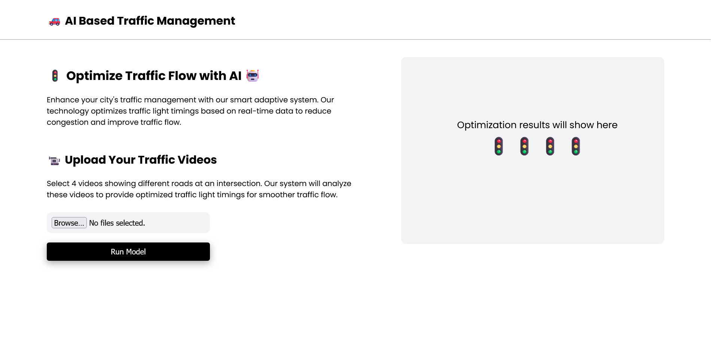

# AI-Based-Traffic-Management-SIH
An AI based traffic management system with real-time monitoring

## 🗒️ Overview

The Smart Adaptive Traffic Management System leverages AI and computer vision to optimize traffic flow at intersections. This system analyzes vehicle counts from video feeds, processes the data using machine learning models, and adjusts traffic signal timings to improve traffic flow.

## 📸 Screenshots

<br/><br/>


## ✨ Features
- Vehicle Detection: Uses YOLOv4 for real-time vehicle detection from video feeds.
- Traffic Optimization: Employs a genetic algorithm to determine optimal green light times based on vehicle counts.
- Web Interface: Allows users to upload traffic videos, view processing results, and receive optimized traffic management recommendations.

## 🚀 Getting Started

### Prerequisites

- Python 3.x
- Nodejs
- OpenCV
- YOLOv4 weights and configuration files
- Required Python packages (listed in requirements.txt)

## 💻 Local Setup

Clone the repository:

```bash
git clone github name
cd TRAFFIC_MANAGEMENT
```

Start the backend server:

```bash
cd backend
pip install -r requirements.txt
python app.py
```

Start the frontend server:
```bash
cd frontend
npm install
npm start
```

Upload Traffic Videos: <br/>
Use the web interface to upload 4 traffic videos. The system will process the videos and display optimized green light times based on the analysis.

## 🙏 Acknowledgments

- YOLOv4: For vehicle detection.
- OpenCV: For video processing.
- Genetic Algorithm: For optimizing traffic light timings.